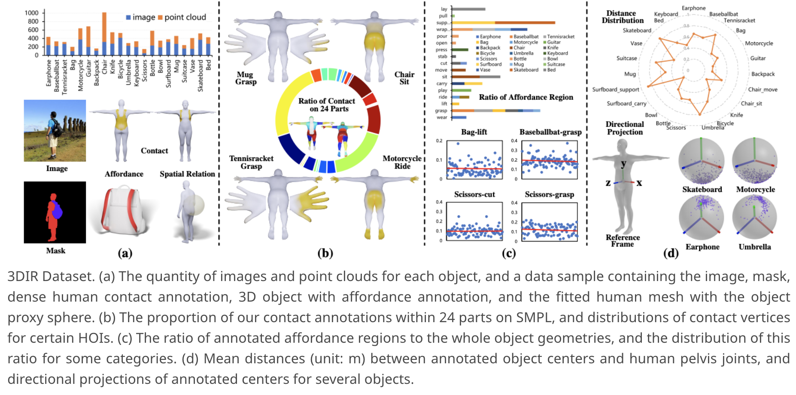

[](https://yyvhang.github.io/LEMON)
[](https://arxiv.org/abs/2312.08963)
# LEMON: Learning 3D Human-Object Interaction Relation from 2D Images <font color=Red>(CVPR2024)</font>

PyTorch implementation of **LEMON: Learning 3D Human-Object Interaction Relation from 2D Images**. The repository will gradually release training, evaluation, inference codes, pre-trained models and 3DIR dataset.

## 📖 To Do List
1. - [X] release the pretrained LEMON.
2. - [X] release the inference, training and evaluation code.
3. - [ ] release the 3DIR dataset.

## 📋 Table of content
 1. [❗ Overview](#1)
 2. [💡 Requirements](#2)
 3. [📖 Dataset](#3)
 4. [✏️ Usage](#4)
    1. [Environment](#41)
    2. [Demo](#42)
    3. [Training](#43)
    4. [Evaluation](#44)
 5.  [✉️ Statement](#5)
 6.  [🔍 Citation](#6)

## ❗Overview <a name="1"></a> 
LEMON seek to parse the 3D HOI elements through 2D images:
<p align="center">
     <br />
    <em> 
    </em>
</p>

## 💡Requirements <a name="2"></a> 
(1) Download the [SMPL-H](https://mano.is.tue.mpg.de/download.php) used in AMASS project, put them under the folder `smpl_models/smplh/`. <br> 
(2) Download the [`smpl_neutral_geodesic_dist.npy`](https://rich.is.tue.mpg.de/download.php) and put it under the folder `smpl_models/`, this is used to compute the metrics geo. <br>
(3) Download the pre-trained [HRNet](https://datarelease.blob.core.windows.net/metro/models/hrnetv2_w40_imagenet_pretrained.pth), put `.pth` file under the folder `tools/models/hrnet/config/hrnet/`. <br>
(4) Download the pre-trained [LEMON](https://drive.google.com/drive/folders/1BPVPLuz1igoz7Ky_RjmHf1arBhlubLns?usp=sharing) (DGCNN as backbone), put `.pt` files under the folder `checkpoints/`, we release checkpoints with and without curvatures.

## 📖Dataset <a name="3"></a>
<p align="center">
     <br />
    <em> 
    </em>
</p>
The 3DIR dataset includes the following data: <br>
(1) HOI images with human and object masks. <br>
(2) Dense 3D human contact annotation. <br>
(3) Dense 3D object affordance annotation. <br>
(4) Pesudo-SMPLH parameters. <br>
(5) Annotation of the Human-Object spatial relation. <br>
The dataset will be released soon!

## ✏️ Usage <a name="4"></a>
### Environment <a name="41"></a> 
First clone this respository and create a conda environment, as follows:
```bash  
git clone https://github.com/yyvhang/lemon_3d.git
cd lemon_3d
conda create -n lemon python=3.9 -y
conda activate lemon
#install pytorch 2.0.1
conda install pytorch==2.0.1 torchvision==0.15.2 torchaudio==2.0.2 pytorch-cuda=11.8 -c pytorch -c nvidia
```
Then, install the other dependancies:
```bash  
pip install -r requirements.txt
```

### Demo <a name="42"></a>
The following command will run LEMON on a hoi pair, if you want to infer without curvature, please modify the parameter at `config/infer.yaml`, you should change the checkpoint path and set `curvature` to False.
```bash  
python inference.py --outdir Demo/output
```
For the visualization in main paper, we use [Blender](https://www.blender.org/) to render the human and proxy sphere, and refer to [IAG-Net](https://github.com/yyvhang/IAGNet/blob/master/rend_point.py) for the object visualization. <br>
<font color=Red>Note</font>: If you use the model with curvature, you should obtain curvatures for the human and object geometry. For convenience, we recommend using [CloudCompare](https://www.danielgm.net/cc/) or [trimesh.curvature](https://trimesh.org/trimesh.curvature.html) for calculation. After testing, LEMON could work well with the curvature calculated through these methods.

### Training <a name="43"></a>
If you want to train LEMON, please run the following command, you could modify the parameter at `config/train.yaml`.
```bash  
bash train.sh
```

### Evaluation <a name="44"></a>
Run the following command to evaluate the model, you could see the setting at `config/eval.yaml`.
```bash  
python eval.py --config config/eval.yaml
```
If you take LEMON as a comparative baseline, please indicate whether to use curvature.


## ✉️ Statement <a name="5"></a> 
This project is for research purpose only, please contact us for the licence of commercial use. For any other questions please contact [yyuhang@mail.ustc.edu.cn](yyuhang@mail.ustc.edu.cn).

## 🔍 Citation

```
@article{yang2023lemon,
  title={LEMON: Learning 3D Human-Object Interaction Relation from 2D Images},
  author={Yang, Yuhang and Zhai, Wei and Luo, Hongchen and Cao, Yang and Zha, Zheng-Jun},
  journal={arXiv preprint arXiv:2312.08963},
  year={2023}
}
```